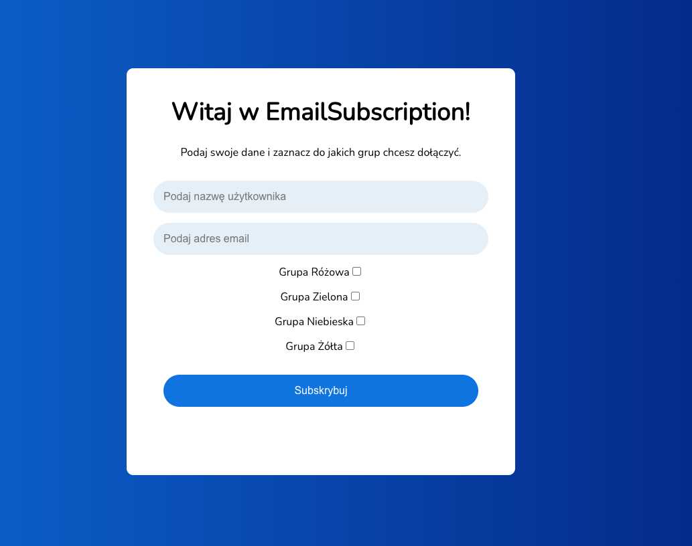

# EmailSubscription

Aplikacja do subskrypcji mailowej z przypisywaniem użytkowników do grup oraz prostym API do wysyłania maili zbiorczych. Stworzona jako projekt edukacyjny / portfolio w .NET 9 + React + TypeScript.

---

## 🚀 Funkcje

- Formularz subskrypcji z dynamicznymi checkboxami grup
- Walidacja formularza i komunikaty dla użytkownika
- Backend oparty na .NET 9 Minimal APIs
- Wysyłanie maili do wszystkich lub do wybranej grupy
- Wysyłanie maila konfirmacyjnego
- Przechowywanie danych w bazie SQLite przy użyciu Entity Framework Core

---

## 🧑‍💻 Jak uruchomić lokalnie

### 1. Sklonuj repozytorium

```bash
git clone https://github.com/jerzyszufa/EmailSubscription.git
cd EmailSubscription
```

---

### ✉️ Konfiguracja SMTP (dla wysyłki e-maili)

Aby umożliwić aplikacji wysyłanie wiadomości e-mail, musisz skonfigurować ustawienia SMTP w pliku `appsettings.Development.json` w katalogu `EmailSubscription.Api`.

#### Przykład konfiguracji:

```json
{
  "Email": {
    "User": "twoj@email.com",
    "Password": "twojehaslo",
    "SmtpHost": "smtp.gmail.com", // lub inny wybrany przez Ciebie dostawca SMTP
    "SmtpPort": 587,
    "SenderName": "EmailSubscriptionApp"
  }
}
```

> ⚠️ **Uwaga:** Jeśli używasz Gmaila, będziesz potrzebować **hasła aplikacyjnego** (nie zwykłego hasła do konta). Upewnij się także, że Twoje konto pozwala na wysyłkę e-maili przez SMTP.

📖 [Zobacz jak wygenerować hasło aplikacyjne w Gmailu (Google Support)](https://support.google.com/accounts/answer/185833?hl=pl)

---

### 3. Uruchom backend

```bash
cd EmailSubscription.Api
dotnet run
```

Backend uruchomi się domyślnie na `https://localhost:5001`.

---

### 4. Uruchom frontend

```bash
cd ../email-subscription-client
npm install
npm start
```

Frontend będzie działać na `http://localhost:3000`.

> Upewnij się, że w `package.json` masz wpis:
> ```json
> "proxy": "https://localhost:5001"
> ```

---

## 🛠 Technologie

- [.NET 9](https://learn.microsoft.com/en-us/dotnet/core/whats-new/dotnet-9) (Minimal APIs)
- [React](https://react.dev/) + [TypeScript](https://www.typescriptlang.org/)
- [Entity Framework Core](https://learn.microsoft.com/en-us/ef/core/)
- [Axios](https://axios-http.com/)

---

## 🔐 Bezpieczeństwo

- Aplikacja nie posiada autoryzacji – wersja demonstracyjna nie powinna być publikowana jako otwarta produkcja.

---

## 📸 Zrzuty ekranu

> 

---

## 📄 Licencja

Projekt edukacyjny – do wykorzystania prywatnego.